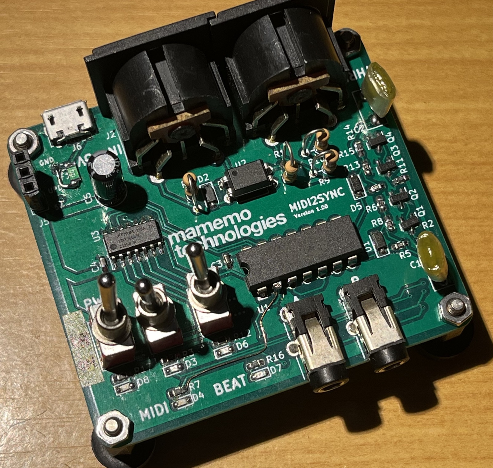
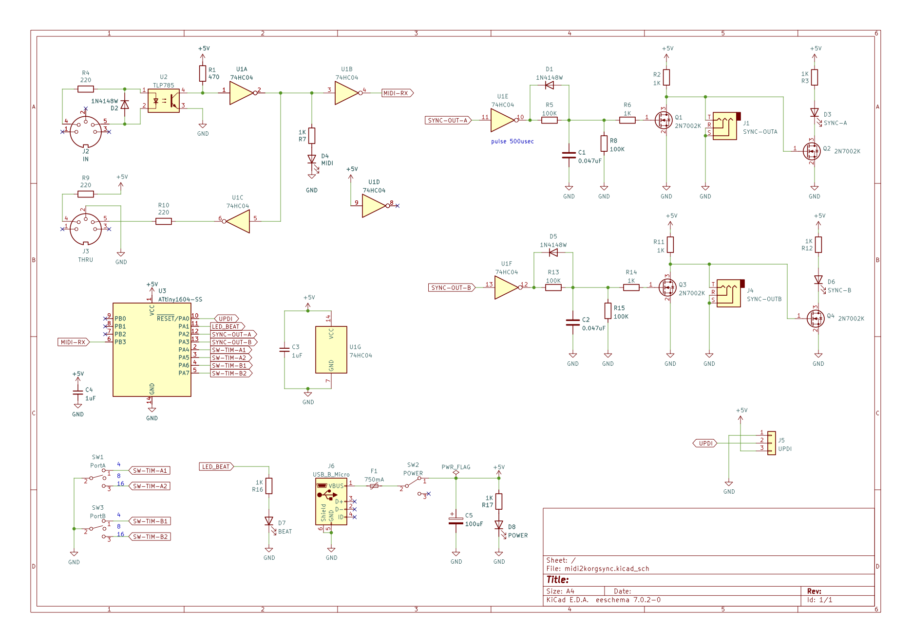

# MIDI2KORGSYNC

MIDI Realtime Clock to KORG SYNC converter

Version 1.00

## Overview

* This device converts MIDI Realtime Clock to KORG SYNC signal.

* The SYNC signal sending can be switched between 2x, standard, and 1/2x speed.

* The machine side should be set to "SyncIN: rising, Sync input/output unit: once every 2 steps", which is the default for KORG devices.

JA

* MIDI Realtime Clock を KORG SYNC信号に変換する装置です。
* SYNC信号の送出を2倍速・標準・1/2倍速に切り替えることができます。
* マシン側はKORG機器のデフォルトである「SyncIN極性:立上り、Sync入出力単位:2ステップに1回」に設定してください。

## Power Supply

USB 5V(MicroUSB)

## Microprocessor

Microchip ATtiny1604

## Development Environments

* [Arduino-CLI](https://www.arduino.cc/pro/software-pro-cli/)
* [megaTinyCore](https://github.com/SpenceKonde/megaTinyCore/)
* [Arduino MIDI Library](https://github.com/FortySevenEffects/arduino_midi_library/)
* UPDI writer

This program uses [jtag2updi](https://github.com/ElTangas/jtag2updi), but as of September 2023, [serialUPDI](https://github.com/SpenceKonde/AVR-Guidance/blob/master/UPDI/jtag2updi.md) is recommended.

このプログラムでは[jtag2updi](https://github.com/ElTangas/jtag2updi)を使用していますが、2023年9月現在、[serialUPDI](https://github.com/SpenceKonde/AVR-Guidance/blob/master/UPDI/jtag2updi.md)の使用をお勧めします。

## Setup Example

    $ arduino-cli config add board_manager.additional_urls 'https://raw.githubusercontent.com/SpenceKonde/ReleaseScripts/master/package_drazzy.com_index.json'
    $ arduino-cli core update-index
    $ arduino-cli core install megaTinyCore:megaavr
    $ arduino-cli lib install "MIDI Library"

## Schematics

There are improvements that need to be made to this circuit, so a new version is in the works.

この回路には改善すべき点があるため、新しいバージョンを制作中です。

## LICENSE

MIT